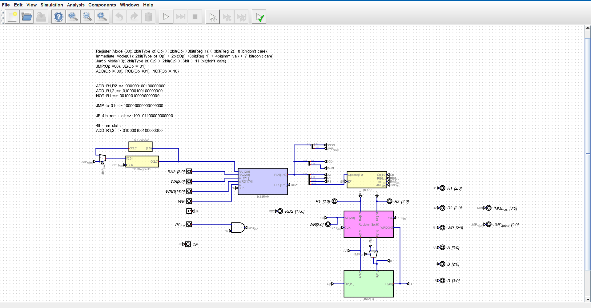

# 4-bit-computer
This was an assignment from the Computer architecture course. I have made a 4-bit Computer in simulation with digital software.
Here were my requirements ==>
1. 4-bit CPU
2. ALU operations of NOT, ADD and ROL
3. Registers - 6
4. RAM size - 8
5. Word size - 18
6. CPU Instructions - Register Mode, Immediate Mode, JMP, JE

